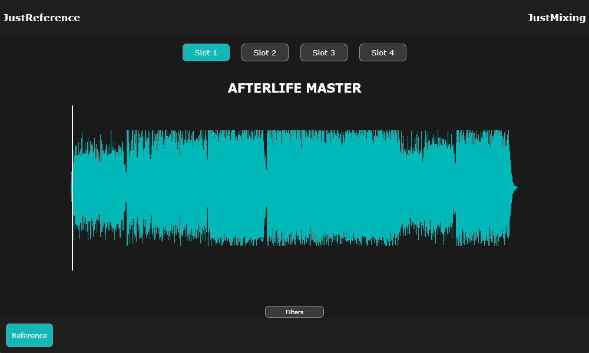

# JUCE Audio Plugin Player

A simple audio plugin (VST/AU) built with JUCE that allows you to load, play, pause, stop, and adjust the gain of audio files. This project is ideal for learning JUCE plugin development and real-time audio control with a clean UI.

---

## Features

- Load `.wav` or `.mp3` files
- Playback controls: Play / Pause / Stop
- Gain control in decibels (dB)
- Real-time audio processing
- Resizable and responsive UI

---

## Plugin Format

This project builds as an **Audio Plugin** compatible with:

- VST3
- AU (on macOS)
- Standalone application (optional)
